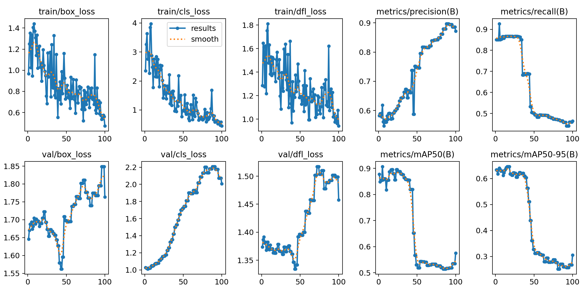
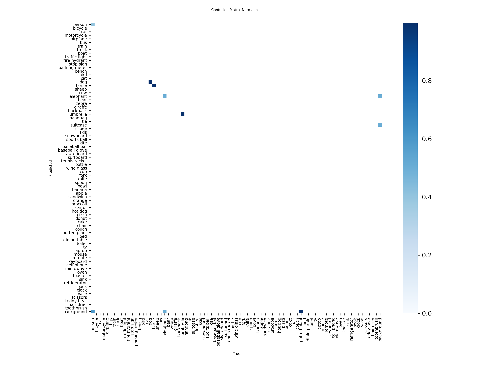

# YOLO-DET
## 1 -- Install environments
## 2 -- Datasets preparing
### 2.1 Find my self datasets 
    Find one flower datasets, download by datasets.

    ``` python

    from datasets import load_dataset

    ds = load_dataset("nsarker/flower-detection")

    ds.save_to_disk("./flower")

    ```
    Then load and transform into YOLO style.

    For data processing, need using labelImg tools do the label work. Here pass.
## 3 -- Training
### 3.1 Run the code by `python3 train.py` 
### 3.2 The results will be saved at the runs file
Part of output at terminal:
```bash

      Epoch    GPU_mem   box_loss   cls_loss   dfl_loss  Instances       Size
    100/100      2.18G     0.4724     0.4484      0.942         13        640: 100% ━━━━━━━━━━━━ 1/1 9.9it/s 0.1s
                 Class     Images  Instances      Box(P          R      mAP50  mAP50-95): 100% ━━━━━━━━━━━━ 1/1 40.2it/s 0.0s
                   all          4         17      0.871      0.464      0.575      0.305

100 epochs completed in 0.015 hours.
Optimizer stripped from /root/CVLearning/Yolo/runs/detect/train/weights/last.pt, 5.5MB
Optimizer stripped from /root/CVLearning/Yolo/runs/detect/train/weights/best.pt, 5.5MB

Validating /root/CVLearning/Yolo/runs/detect/train/weights/best.pt...
Ultralytics 8.3.204 🚀 Python-3.11.13 torch-2.8.0+cu128 CUDA:0 (NVIDIA GeForce RTX 4090 D, 24111MiB)
YOLO11n summary (fused): 100 layers, 2,616,248 parameters, 0 gradients, 6.5 GFLOPs
                 Class     Images  Instances      Box(P          R      mAP50  mAP50-95): 100% ━━━━━━━━━━━━ 1/1 48.7it/s 0.0s
                   all          4         17      0.571      0.867      0.895      0.646
                person          3         10      0.608        0.7      0.646      0.324
                   dog          1          1      0.505          1      0.995      0.796
                 horse          1          2      0.578          1      0.995       0.65
              elephant          1          2      0.363        0.5      0.745      0.315
              umbrella          1          1      0.543          1      0.995      0.895
          potted plant          1          1      0.831          1      0.995      0.895
Speed: 0.3ms preprocess, 1.7ms inference, 0.0ms loss, 0.6ms postprocess per image
Results saved to /root/CVLearning/Yolo/runs/detect/train
```

like this :

## 4 -- Val
### 4.1 run the code by `python3 val.py` (need change the path)
### 4.2 Get the results :
like this:
```bash
(YOLO) root@autodl-container-082241a9d0-187df850:~/CVLearning/Yolo# python3 val.py
Ultralytics 8.3.204 🚀 Python-3.11.13 torch-2.8.0+cu128 CUDA:0 (NVIDIA GeForce RTX 4090 D, 24111MiB)
YOLO11n summary (fused): 100 layers, 2,616,248 parameters, 0 gradients, 6.5 GFLOPs
Downloading https://ultralytics.com/assets/Arial.ttf to '/root/.config/Ultralytics/Arial.ttf': 100% ━━━━━━━━━━━━ 755.1KB 2.4MB/s 0.3s
val: Fast image access ✅ (ping: 0.0±0.0 ms, read: 495.0±127.8 MB/s, size: 54.0 KB)
val: Scanning /root/CVLearning/Yolo/datasets/coco8/labels/val.cache... 4 images, 0 backgrounds, 0 corrupt: 100% ━━━━━━━━━━━━ 4/4 43.8Kit/s 0.0s
                 Class     Images  Instances      Box(P          R      mAP50  mAP50-95): 100% ━━━━━━━━━━━━ 1/1 4.2it/s 0.2s
                   all          4         17      0.576      0.867      0.898      0.646
                person          3         10      0.611        0.7      0.663      0.327
                   dog          1          1      0.507          1      0.995      0.796
                 horse          1          2      0.585          1      0.995       0.65
              elephant          1          2      0.364        0.5      0.745      0.314
              umbrella          1          1      0.544          1      0.995      0.895
          potted plant          1          1      0.843          1      0.995      0.895
Speed: 1.2ms preprocess, 22.3ms inference, 0.0ms loss, 15.7ms postprocess per image
```
And one result img of val:

## 5 -- Pre
### 5.1 Then can use this trained model to do the prediction work
Input one img then get the class results
Run by this command: `python3 pre.py` 
### 5.2 Get the results
Get the final results:
the text output at terminal:
```bash
(YOLO) root@autodl-container-082241a9d0-187df850:~/CVLearning/Yolo# python3 pre.py

Downloading https://ultralytics.com/images/bus.jpg to 'bus.jpg': 100% ━━━━━━━━━━━━ 134.2KB 896.5KB/s 0.1s
image 1/1 /root/CVLearning/Yolo/bus.jpg: 640x480 4 persons, 1 bus, 88.8ms
Speed: 5.9ms preprocess, 88.8ms inference, 127.2ms postprocess per image at shape (1, 3, 640, 480)
```